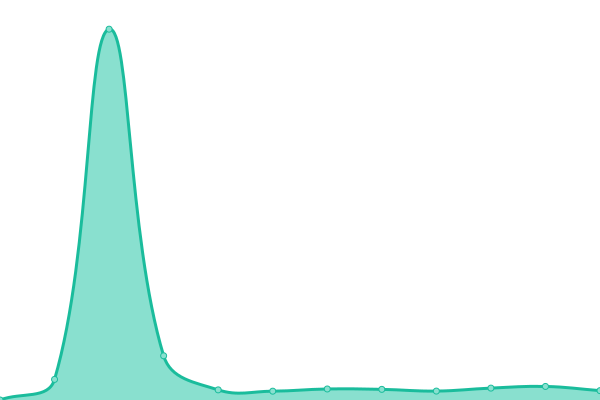

# [📈 Live Status](https://alter095.github.io/monitor_upptime): <!--live status--> **全システム動作中**

This repository contains the open-source uptime monitor and status page for [alter095](https://alter095.github.io/monitor_upptime), powered by [Upptime](https://github.com/upptime/upptime).

With [Upptime](https://upptime.js.org), you can get your own unlimited and free uptime monitor and status page, powered entirely by a GitHub repository. We use [Issues](https://github.com/alter095/monitor_upptime/issues) as incident reports, [Actions](https://github.com/alter095/monitor_upptime/actions) as uptime monitors, and [Pages](https://alter095.github.io/monitor_upptime) for the status page.

<!--start: status pages-->
<!-- This summary is generated by Upptime (https://github.com/upptime/upptime) -->
<!-- Do not edit this manually, your changes will be overwritten -->
<!-- prettier-ignore -->
| URL | Status | History | Response Time | Uptime |
| --- | ------ | ------- | ------------- | ------ |
|  [massmist](https://massmist.net/) | 🟩 Up | [massmist.yml](https://github.com/alter095/monitor_upptime/commits/HEAD/history/massmist.yml) | 

 674ms
     
 | 

<a href="https://monupp.massmist.net/history/massmist">99.84%</a>
    

|  [dp-massmist -Dolphin-](https://dp.massmist.net/) | 🟩 Up | [dp-massmist-dolphin.yml](https://github.com/alter095/monitor_upptime/commits/HEAD/history/dp-massmist-dolphin.yml) | 

 506ms
     
 | 

<a href="https://monupp.massmist.net/history/dp-massmist-dolphin">99.84%</a>
    

<!--end: status pages-->

[**Visit our status website →**](https://alter095.github.io/monitor_upptime)

## 📄 License

- Powered by: [Upptime](https://github.com/upptime/upptime)
- Code: [MIT](./LICENSE) © [alter095](https://alter095.github.io/monitor_upptime)
- Data in the `./history` directory: [Open Database License](https://opendatacommons.org/licenses/odbl/1-0/)
